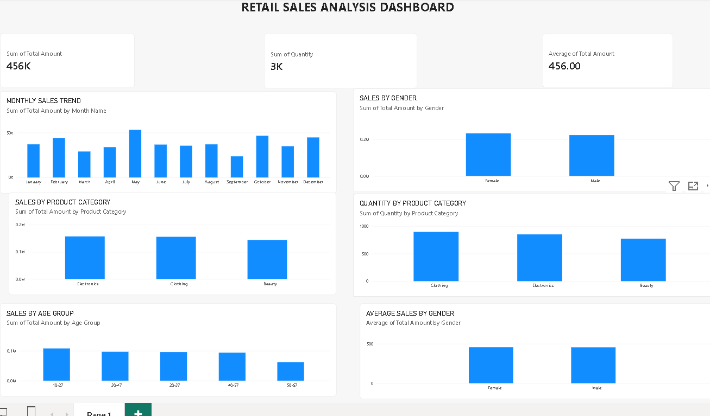

# Retail Sales Data Analysis using Python and Power BI
## Project Overview

This project analyzes retail sales data using Python and Power BI to identify sales trends, customer patterns, and product performance. The project includes data cleaning, exploratory data analysis, SQL analysis, and an interactive Power BI dashboard.
## Tools & Technologies

- Python
- Pandas
- NumPy
- Power BI
- GitHub

## Dataset

The dataset contains 1,000 retail transactions with information about:

- Transaction ID
- Date
- Customer ID
- Gender
- Age
- Product Category
- Quantity
- Price per Unit
- Total Amount

## Data Analysis

The data was explored and validated using Python and Pandas. The analysis includes:

- Data cleaning and validation
- Monthly sales analysis
- Sales by gender
- Sales by product category
- Quantity sold by category
- Average sales by gender
- Sales by age group

## Power BI Dashboard

The Power BI dashboard contains KPI cards and visualizations for analyzing retail sales performance.

The dashboard includes:

- Total Sales
- Total Quantity Sold
- Average Sales
- Monthly Sales Trend
- Sales by Gender
- Sales by Product Category
- Quantity Sold by Product Category
- Sales by Age Group
- Average Sales by Gender

### Key Insights

- Total sales: ₹456,000
- Total quantity sold: 2,514 units
- Average transaction value: ₹456
- May recorded the highest monthly sales.
- September recorded the lowest monthly sales.
- Electronics generated the highest sales among the product categories.
- Clothing had the highest quantity sold.

## Project Files

- 01_data_exploration.py — Python data exploration script
- Power BI .pbix file — Interactive sales dashboard

## Conclusion

This project helped analyze retail sales data and identify useful business trends using Python and Power BI. It provided practical experience in data cleaning, analysis, visualization, and extracting insights from data.
